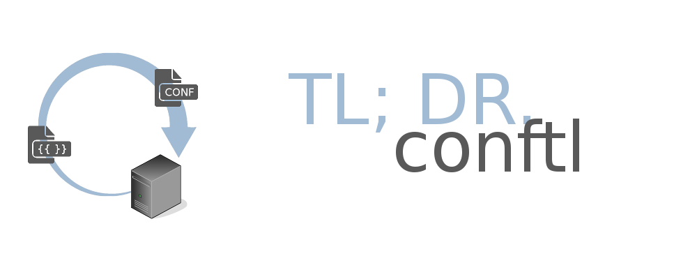

# Configuration Templating Language

Simple to learn but yet powerful language for templating your configuration files.

## Features

* Simple to learn - a person familiar with the Python syntax basics could dive into conftl for 15 min.

* Powerful - Python code in templating.

* Command line tool for rendering.

* Python API for rendering

* Suitable for system administration, devops and similar roles.

* Performance - minimal code base optimized for performance.

* Platform independent - tested under Linux and Windows, should work on other Unix platforms as well, Python 2.7 compatible, Python 3.x compatible.

## Getting Started

Install conftl using pip:

```bash
$ pip install conftl
```

Hello world from the command line:

```bash
$ render -c "name='John Smith'"
Hello, {{=name}}
Hello, John Smith
```

NOTE: Unix: Write ```Hello, {{=name}}``` on stdin, followed by Enter, Ctr+D

NOTE: Windows: Write ```Hello, {{=name}}``` on stdin, followed by Enter, Ctr+Z, Enter

Hello world from the Python REPL:

```python
>>>
>>> from conftl import render
>>>
>>> render(content='Hello, {{=name}}', context=dict(name='John Smith'))
'Hello, John Smith'
>>>
```

## Prerequisites

Linux or other Unix distribution or Windows.

Python 2.7 or Python 3.x

Please place an [issue](https://github.com/ttt-fifo/conftl/issues) in case the current implementation is not working with your platform and I will help.

Python Modules: [future](https://pypi.python.org/project/future)

## Template Syntax Quickstart

As conftl embeds Python syntax in template, the prerequisite is to know the basic Python syntax.
After accomplishing this prerequisite, the one must remember only the following three rules:

**Rule 1)** Python code should be enclosed in tags ```{{...}}```

```python
TEMPLATE                    | WILL OUTPUT
------------------------------------------
{{                          |
import sys                  |
def one():                  |
    return 1                |
i = 3                       |
}}                          |
------------------------------------------
```

NOTE: this Python code does not output anything, just imports, defines function, assigns variable.

**Rule 2)** Python blocks must end with the keyword ```{{pass}}```

```python
TEMPLATE                    | WILL OUTPUT
------------------------------------------
{{for i in range(0, 3):}}   | Hi, there!
Hi, there!                  | Hi, there!
{{pass}}                    | Hi, there!
------------------------------------------
```

**Rule 3)** Variables are printed to output enclosed in tags and prepended with = like ```{{=i}}```

```python
TEMPLATE                    | WILL OUTPUT
------------------------------------------
{{for i in range(0, 3):}}   | Listen 8080
Listen 808{=i}              | Listen 8081
{{pass}}                    | Listen 8082
------------------------------------------
```

For advanced syntax description see [TEMPLATE_SYNTAX.md](https://github.com/ttt-fifo/blob/master/docs/TEMPLATE_SYNTAX.md)

Coming from Jinja? See [JINJA.md](https://github.com/ttt-fifo/blob/master/docs/JINJA.md)

Coming from Web2py? See [WEB2PY.md](https://github.com/ttt-fifo/blob/master/docs/WEB2PY.md)

## Examples

Take a look at the [examples folder](https://github.com/ttt-fifo/conftl/blob/master/examples) for catching conftl in action.

## Command Line Tool for Rendering (render)

conftl comes with a command line tool for quick and easy templating. It works like this:

```bash
$ render -i templatename.tmpl - o filename.conf

-i input template
-o output configuration file
```

Full description could be found in [COMMAND_LINE.md](https://github.com/ttt-fifo/conftl/blob/master/docs/COMMAND_LINE.md)

## Python API

There are three interfaces for rendering a template from Python: the function ```render(...)```, the class ```Render``` and the decorator ```@template(...)``` .

The API description could be found here: [PYTHON_API.md](https://github.com/ttt-fifo/conftl/blob/master/docs/PYTHON_API.md)

## Known Limitations

* Arbitrary Python code is possible to be executed by the current templating language. I would advice against giving opportunity to the end-users to write template code, unless you know what you are doing. Multiple attack vectors could be used by a malicious end-user who has the possibility to execute arbitrary Python code. See [security_considerations.txt](https://github.com/ttt-fifo/conftl/blob/master/docs/security_considerations.txt)

* In case you want to template some HTML output, you would be better off using other templating languages:

* web2py's templating language called [yatl](https://github.com/web2py/yatl)

* [Jinja](https://github.com/pallets/jinja)

The templating languages above have HTML escaping switched on by default, helper functions and other features suitable for web services.

## Contributing

Testing implementation on different platforms.

Place [issue](https://github.com/ttt-fifo/conftl/issues) if you spot issues with this code.

Do not hesitate to fork me on github.

## Versioning

See [HISTORY.txt](https://github.com/ttt-fifo/conftl/blob/master/HISTORY.txt)

Also see the [tags](https://github.com/ttt-fifo/conftl/tags) on the [conftl repositiory](https://github.com/ttt-fifo/conftl).

The current project uses [Semantic Versioning](https://semver.org)

## Authors

**Todor Todorov** - [ttt-fifo](https://github.com/ttt-fifo)

## License

This is open source software, free for personal and commercial use, licensed under:

BSD + other copyright credits

See [LICENSE](https://github.com/ttt-fifo/conftl/blob/master/LICENSE) for details.

## Acknowledgments

Thanks to [Massimo Di Pierro](https://github.com/mdipierro) and the [web2py](https://github.com/web2py) team for the inspiration.

Logo: [server](https://www.vrt.com.au/downloads/vrt-network-equipment), [icons](http://hawcons.com/), [arrow](https://longfordpc.com/)

## See Also

[web2py on github](https://github.com/web2py/web2py)

web2py templating language [yatl](https://github.com/web2py/yatl)

Another implementation of the same templating language may be found at the [weppy](https://github.com/gi0baro/weppy) project.

[jinja on github](https://github.com/pallets/jinja)
