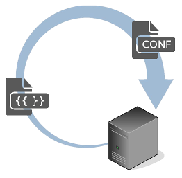

# Configuration Templating Language

Simple to learn but yet powerful language for templating your configuration files. It is a 'slang' of the [web2py](http://www.web2py.com)'s templating language, written from scratch and optimized for textual non-html data.

## Features

* Simple to learn - a person who has some idea of the Python syntax could dive into conftl for 15 min.

* Powerful - Python code in templating.

* Command line tool for rendering.

* Different methods for trigerring rendering from Python code.

* Suitable for system administration, devops and similar roles.

* Performance - minimal code base optimized for performance.

* Platform independent - tested under Linux and Windows, should work on other Unix platforms as well, Python 2.7 compatible, Python 3.x compatible.

## Getting Started

Install conftl using pip:

```
pip install conftl
```

Alternatively download the source code:

```
git clone https://github.com/ttt-fifo/conftl
cd conftl
python setup.py install
```

Hello world from the command line:

```bash
$ render -c "name='John Smith'"
Hello, {{=name}}
Hello, John Smith
```

NOTE: Write ```Hello, {{=name}}``` on stdin, followed by Enter, Ctr+D

Hello world from the Python REPL:

```python
>>>
>>> from conftl import render
>>>
>>> render(content='Hello, {{=name}}', context=dict(name='John Smith'))
'Hello, John Smith'
>>>
```

## Prerequisites

Linux or other Unix distribution or Windows.

Python 2.7 or Python 3.x

Please place an [issue](https://github.com/ttt-fifo/conftl/issues) in case the current implementation is not working with your platform and I will try to help.

Python Modules: future

## Templating Kickstart

* **Clear text from the template is printed to the output as is**

```
lorem ipsum dolor sim amet
text clear lorem ipsum
```

will go exactly the same into the output

```
lorem ipsum dolor sim amet
text clear lorem ipsum
```

* **Python code in template should be written using tags** ```{{ ...code... }}```

For example if you would like to assign a value ```3``` to ```i```, you can do it using the following syntax:

```{{i = 3}}```

You could also write multiline Python code as well - like the following example:

```
{{
import sys

def one():
    return 1

i = 3
}}
```

* **Printing a variable value to the output** is done by tagging it and placing = sign in front of the variable like this ```{{=myvar}}```

For example if ```i``` has the value of ```3``` and you put in template:

```{{=i}}```

you will receive in the output:

```3```

* **Combining a Python code block with clear text and variable outputs** - you should not indent the code block as you normally do with Python, but you should determine it with ```{{pass}}``` special keyword instead.

Whenever you write a code block into the original Python interpreter you indent the code. Lets take the following example of original Python code block:

```python
for i in range(0, 2):
    print('X', i)
```

The equivalent of the above code would be:

```
{{for i in range(0, 2):}}
X {{=i}}
{{pass}}
```

* **You are able to pass values to template variables from outside of the template** - there are multiple methods to give 'context' to the template, e.g. assigning variable values outside of the template. Look the follow up sections.

* **Advanced templating topics** could be found at [TEMPLATING.md](https://github.com/ttt-fifo/conftl/blob/master/TEMPLATING.md)

## Examples

Take a look at the [examples folder](https://github.com/ttt-fifo/conftl/tree/master/examples) from the project repository.

## Command Line Tool for Rendering (render)

* **The render command line tool works as follows:**

```
render -i templatename.tmpl -o filename.conf
```

will take the template from file ```templatename.tmpl``` and write the output to ```filename.conf```

WARNING: filename.conf will be overwriten!!!

In case input template is not given by -i, you would be expected to place template code on stdin.

NOTE: For Linux and other Unix systems write template code and finish it with Ctr + D

NOTE: For Windows finish template code with with Ctr + Z and then hit ENTER

In case the output filename (-o) is not given, the output will be written to stdout.

* **Giving context variables on the command line**

You want to give ```i``` value of ```4``` and use it in your template. Use -c flag:

```
render -i templatename.tmpl -o filename.conf -c i=4
```

For assigning values to multiple variables, just repeat -c flag multiple times:

```
render -i templatename.tmpl -o filename.conf -c i=4 -c j=8 -c x=2
```

For assigning complex variable datatypes, wrap assignment in double quote like this:

```
render -i templatename.tmpl -o filename.conf -c "mydict={'a': 1, 'b': 'string'}"
```

* **Context from json file**

The json file format should be similar to:

```json
{"myvar": 4,
 "otherthing": [1, 3, 5],
 "stringsomething": "hello world"
}
```

You can invoke render by giving the -j option like this:

```
render -i mytemplate.tmpl -j mycontext.ctx
```

NOTE: the command line variables have precedence over json file, e.g. if you assign i=2 in json file and i=3 on command line, the final value of i will be i=3.

* **Environment in context for convenience**

For convenience the ENV dictionary is automatically included in the context and it contains the OS environment variables. The following example prints them on the screen:

```
render
{{for e in ENV:}}
{{=e}} : {{=ENV[e]}}
{{pass}}
..................................
... environment will come here ...
..................................
```

NOTE: the ENV is included automatically in context only with the command line tool, rendering from Python (the next section) does not have ENV automatically in context.

*How to use ENV in templates?*

Many devops / sysadmin systems pass data to their underlying scripts via environment variables. As an example the following shell commands:

```
$ export SYSTEM=production
$
$ render
{{if ENV['SYSTEM'] == 'production':}}
Listen 80
{{elif ENV['SYSTEM'] == 'ci_cd':}}
Listen 8080
{{elif ENV['SYSTEM'] == 'devel':}}
Listen 8081
{{else:}}
{{raise RuntimeError('wrong SYSTEM')}}
{{pass}}
```
(Ctr+D at the end)

will give you the output based on the SYSTEM environment variable:

```
Listen 80
```

* **Command line tool help**

See ```render -h```

## Rendering Template from Python

There are three interfaces for rendering a template from Python: the function ```render(...)```, the class ```Render``` and the decorator ```@template(...)``` . Please see the explanation below:

* **render(...) function**

Consider the following example:

```python
>>>
>>> from conftl import render
>>> render(content='{{=i}}', context=dict(i=8))
'8'
>>>
```

As you can see, you can give the context= value, which is a dict, containing your variable data.

The signature of the function follows:

```python
render(infile=None,
       outfile=None,
       context=None,
       content=None,
       delimiters=None)
```

You can use the function by giving infile= as argument (this is the template file). If not given, you should give the content= value - this would be a string with the template content.

Output file could be given by outfile= argument. If given, the output will be written to this file. On outfile= absence, the output is returned as string.

In case you need to use other delimiters than the default ```{{ }}```, you can change the delimiters like this:

```python
>>>
>>> render(content='[[=i]]', context=dict(i=7), delimiters='[[ ]]')
'7'
>>>
```

* **template decorator**

Define a function which returns the context as a dict. Decorate your function with template decorator:

```python
from conftl import template

# Define your function, which should output a dict
# with the template context and decorate it with
# template decorator

@template(infile='mytemplate.tmpl', outfile='myconf.conf')
def template_myconf(*arg, **kwarg):

    # ...here your complex computations...
    i = ....
    j = ....
    x = '.....'

    return dict(i=i, j=j, templ_var=x)

if __name__ == '__main__':

    # Here invoke your function and it should create
    # the needed myconf.conf

    template_myconf(... some args...)
```

The possible arguments for template decorator are

```python
@template(infile=None,
          outfile=None,
          content=None,
          delimiters=None)
```

You must give eihter infile= or content= as input. You can omit outfile= and in this case the decorated function will return the output as a string. Changing delimiters= is also possible. The function, decorated with template(...) must return dict, otherwise exception is raised.

This type of context computation is well know by the web2py users, because this is the layout of the web2py controller.

* **Render object**

An object from Render class could be used in a long running processes. Load the object in memory once and use it multiple times for templating multiple files:


```python
from conftl import Render

rndr = Render()

# ... use it multiple times like this
rndr.instream = open('filename.tmpl', 'r')
rndr.outstream = open('otherfile.conf', 'w')
rndr.context = dict(i=..., j=..., somevar='...')

rndr()

rndr.instream.close()
rndr.outstream.close()
# ....
```

The ```instream``` and ```outstream``` should be file handles or StringIO objects.

## Known Limitations

* Arbitrary Python code is possible to be executed by the current templating language. I would advice against giving opportunity to the end-users to write template code, unless you know what you are doing. Multiple attack vectors could be used by a malicious end-user who has the possibility to execute arbitrary Python code.

* In case you want to template a HTML output, you would be better off using the web2py's templating language (called [yatl](https://github.com/web2py/yatl)). Yatl has XML escaping switched on by default and also multiple HTML helper functions.

## Contributing

Testing implementation on different platforms.

Do not hesitate to fork me on github.

Place [issue](https://github.com/ttt-fifo/conftl/issues) if you spot issues with this code.

## Versioning

See the [tags](https://github.com/ttt-fifo/conftl/tags) on this repository.

## Authors

**Todor Todorov** - [ttt-fifo](https://github.com/ttt-fifo)

## License

BSD + other copyright credits

See [LICENSE](https://github.com/ttt-fifo/conftl/blob/master/LICENSE) for details.

## Acknowledgments

Thanks to [Massimo Di Pierro](https://github.com/mdipierro) and the [web2py](https://github.com/web2py) team for the inspiration.

Logo: [server](https://www.vrt.com.au/downloads/vrt-network-equipment), [icons](http://hawcons.com/), [arrow](https://longfordpc.com/)

## See Also

Differences between conftl and yatl from the document [differences_yatl.txt](https://github.com/ttt-fifo/conftl/blob/master/docs/differences_yatl.txt)

[web2py on github](https://github.com/web2py/web2py)

web2py templating language [yatl](https://github.com/web2py/yatl)

Another implementation of the same templating language may be found at the [weppy](https://github.com/gi0baro/weppy) project.
